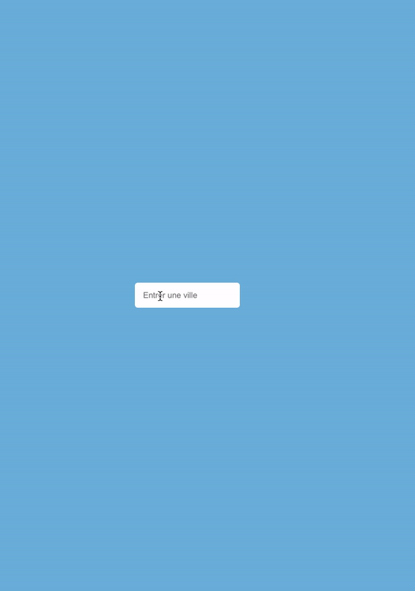

# react-widget-meteo

## Introduction

react-widget-meteo is a reaction project that displays the weather in real time with a small icon and degrees.
The API used is [openwather](https://openweathermap.org/api).

##  Content

## Support

Please file issues here at Github.

Mail: alex-viard@hotmail.fr 

Created and maintained by [Alex Viard](https://github.com/AlexViard)